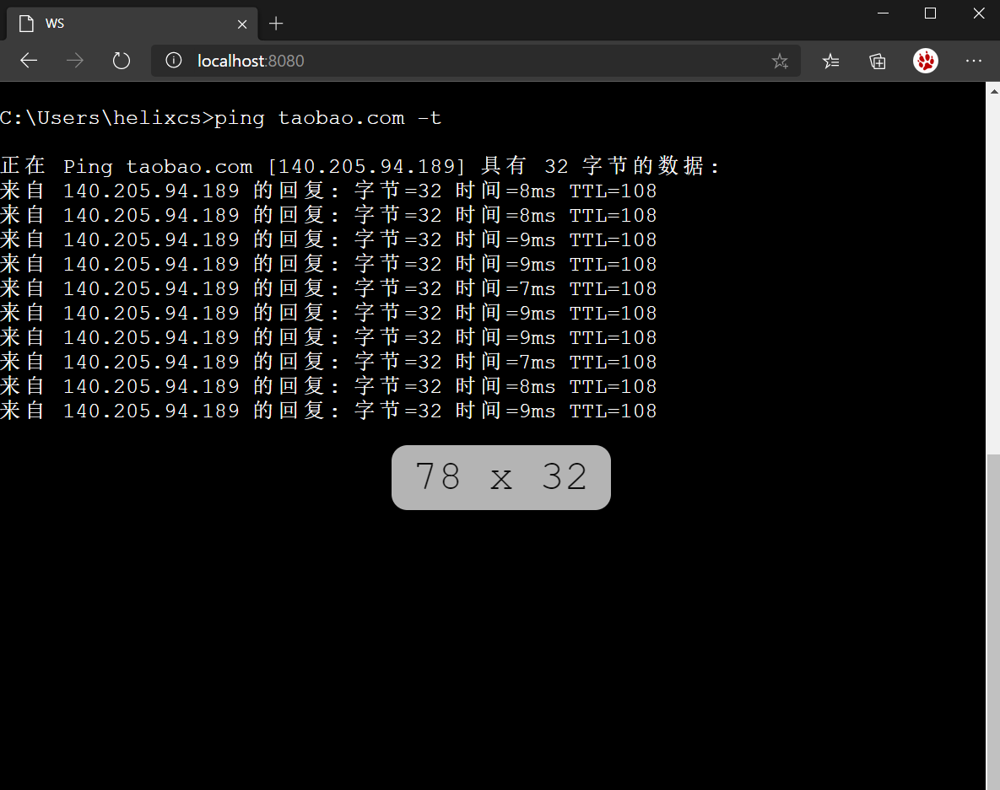

# rmt - Web tty终端

rmt (Terminal Control  Manager) ,基于 [Pty4J](https://github.com/JetBrains/pty4j) 的 Web 终端.

## 开始

* docker 运行

* 脚本运行

## 拓展

## 最后

* 始于 [cloudterm](https://github.com/javaterminal/cloudterm) , 更胜于此.
* 献予[瑞梅](https://yuruimei.com).

## LICENSE

Apache2

This Project Powered by Jetbrains OpenSource License

