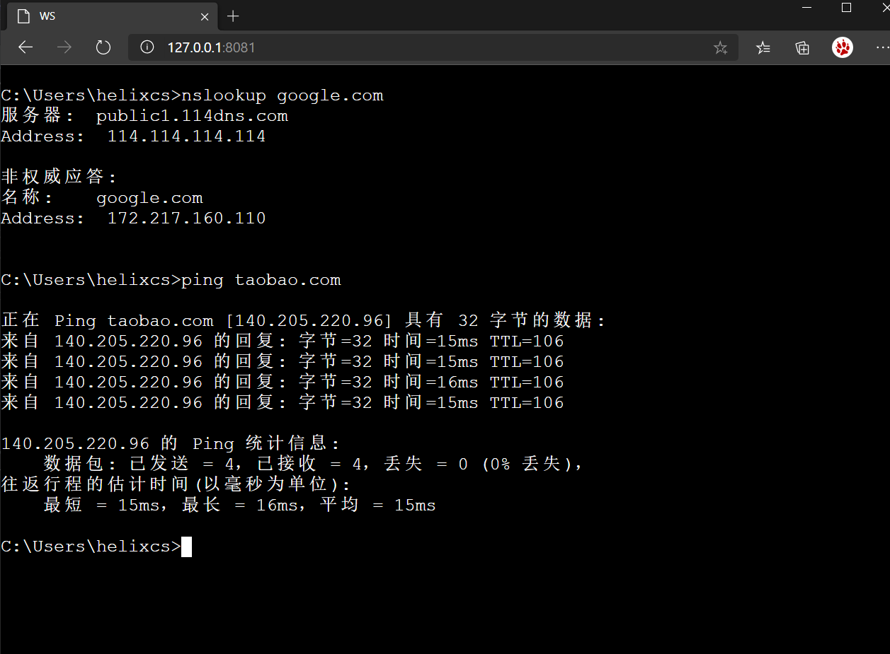

## RMT : A Cloud Web Terminal

[中文简体](cn.md)

[](https://travis-ci.org/Xarrow/RMT)
[](https://openjdk.java.net/install/)

A cloud web terminal based on Spring Boot , Pty4J and WebSocket.


> in Windows


> in Linux


Visit heroku example site: [https://rmt-ns.herokuapp.com/](https://rmt-ns.herokuapp.com/)
## Quick Start

you can download standalone jar from [release](https://github.com/Xarrow/RMT/releases/).

* for docker running

  ```
    docker pull helixcs/rmt:latest
  
    docker run -d -e PORT=8080 -e JVM_PARMS="-Xms512m -Xmx512m -Xmn256m" -p 8080:8080 helixcs/rmt:latest
  ```
  
* for jar running, required jre 1.8+

    ```java
      java -Xms512m -Xmx512m -Xmn256m -Dfile.encoding=UTF-8 -Dserver.port=8080 -jar rmt-app.jar 
    ```

## For Develop

1. checkout from github

    `git@github.com:Xarrow/RMT.git`

2. maven install 
    
    `mvn install -Dmaven.test.skip=true`
    
3. run with jar
    
    `java -Dfile.encoding=UTF-8 -Dserver.port=8080 -jar rmt-app\target\rmt-app-1.0-SNAPSHOT.jar`
    
## Just Expand todo
* Protocol 
   
* Listener
  I. `TerminalProcessListener`
  ```java
    new TerminalProcessListener() {
                @Override
                public String listenerName() {
                      // declare your listener
                    return "mylistener";
                }
                
                // get TerminalProcessLifecycle to do anything.
                @Override
                public void lifeCycleContext(TerminalProcessLifecycle terminalProcessLifecycle) {
                    System.out.println("lifeCycle");
                }
  
              // get command byte[] before send to pty
              @Override
              public void requestToPty(byte[] bytes) {
                  
              }
  
              // get raw  byte[] response which is returned by pty
              @Override
              public void responseFromPty(byte[] bytes) {
                  
              }
            }
  ```
  In this expand , you get lifecycle of process action. Record command log for actions audit.
  
  Reference at [rmt-examples]() for detail.
  
* Session
  I. `TerminalSessionManager`
  ```java
     @Bean
        public TerminalSessionManager terminalSessionManager() {
            return new DefaultTerminalSessionManager();
        }
   ```
  In this expand,websocket session has been wrappered in `SessionWrapper`.
  You can manager all websocket sessions which are connected.  
  List all sessions by `sessionMap`,get a session use `getSession`,
  event use `p2pSend` or `broadCastSend` to send  messages to client. 
  

* Process

* All In One

## Final
* For [RuiMei]() .

* Started from [cloudterm](https://github.com/javaterminal/cloudterm) ,stronger with RMT.

## LICENSE

Apache2

This Project Powered By Jetbrains OpenSource License

